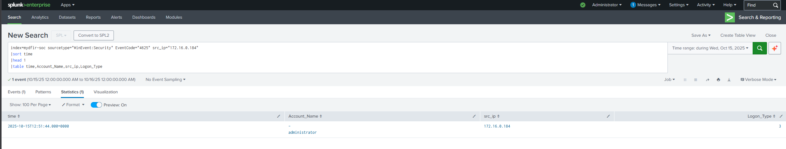

# Capstone Report

# Capstone Investigation Report

**Incident Date:** 15 October 2025

**Timezone:** UTC

**Index:** `mydfir-soc`

**Host:** `FRONTDESK-PC1.KCD.local`

**Analyst: Oliver Sweeney**

---

# Findings

## 1. Password Spraying Activity

On October 15 2025 at `12:51:44UTC` a high volume of failed authentication attempts was observed originating from `172.16.0.184` against multiple domain accounts, consistent with a credential spray pattern. The targeted accounts included:

- `administrator`
- `andrew.henderson`
- `guest`
- `ryan.adams`

### Evidence




```
index=mydfir-soc sourcetype="WinEvent:Security" EventCode=4625 src_ip="172.16.0.184"
|stats count by Account_Name
|sort - count
```

---

## 2. Successful Authentication

A successful authentication event was observed only for the `ryan.adams` account originating from the same source IP. No successful logons were observed for the other targeted accounts, indicating that only the `ryan.adams` credentials were successfully used. The session started at `12:55:17UTC` with a `Logon_ID` of `0xCB817C`.

### Evidence

**Evidence – Successful Logon for `Ryan.Adams`**


```
index=mydfir-soc sourcetype="WinEvent:Security" EventCode=4624
src_ip="172.16.0.184" Account_Name="ryan.adams"
|table _time, Account_Name, src_ip, Logon_Type, Logon_ID
|sort _time
```

**Evidence – No Successful Logons for Other Accounts**


```
index=mydfir-soc sourcetype="WinEvent:Security" EventCode=4624 src_ip="172.16.0.184"
(Account_Name="administrator" OR Account_Name="andrew.henderson" OR Account_Name="guest")
|table _time, Account_Name, Logon_Type
```

---

## 3. Defender Disabled

Following the successful authentication, Windows Defender real-time protection was disabled at `12:55:50UTC`. Additional Defender configuration changes were also logged, indicating that endpoint protection settings were modified.

### Evidence


```
index=mydfir-soc sourcetype="WinEvent:Defender" EventCode=5001
|table _time, ComputerName, Message
```

Defense evasion occurred prior to payload download and execution. Which suggests malicious intent.

---

## 4. Malicious Tool Transfer

Suricata telemetry confirmed a successful HTTP download of /python.exe

Network telemetry confirmed an HTTP request to an external IP address (`157.245.46.190`) to retrieve a file named `python.exe` over port `9999` at `12:59:26UTC`. The request completed successfully, supporting that a payload was delivered from external infrastructure.

- `157.245.46.190`
- Port `9999`
- `HTTP Status 200`
- Return traffic from `157.245.46.190` to the internal host was observed over an ephemeral client port, consistent with standard `TCP` session behavior during file transfer.
- It should be noted that time timeline for the download seems to be slightly off due to a delay when the logs may have been ingested.

### Evidence


```

index=mydfir-soc dest_ip=157.245.46.190 dest_port=9999 http.url="/python.exe"
|table _time, src_ip, dest_ip, dest_port, http.status
```

---

## 5. Malicious File Creation

The file downloaded from `157.245.46.190:9999/python.exe` was written to:

`C:\Users\Ryan.Adams\Music\python.exe`

### Evidence


```
index=mydfir-soc sourcetype="WinEvent:Sysmon"EventCode=15TargetFilename="*\\Ryan.Adams\\Music\\python.exe"| table _time,TargetFilename,User,Hash
```

---

## 6. File Hash Intelligence Validation

Extracted SHA256:


```
CFFAB896E9F0B12101034D9CED76332EF5AA4036AFA08E940E825E277C21A044
```

### Cisco Talos File Reputation

- Disposition: Unknown
- Detection Name: Not found
- Associated Domains: None

The absence of classification suggests low distribution or custom tooling.

Despite no static detection, behavioral telemetry confirms malicious intent based on:

- Immediate defense evasion
- C2 communication
- Persistence creation

Behavioral indicators outweigh lack of static detection.

---

## 7. Payload Execution

At `13:00:33UTC` the payload “`python.exe`” was subsequently executed  via Windows Explorer

### Evidence


```
index=mydfir-soc sourcetype="WinEvent:Sysmon" EventCode=1
Image="*\\python.exe"
|table _time, Image,User, ParentImage, CommandLine
```

Execution occurred immediately after download.

---

## 8. Command and Control Communication

Outbound network communication was then observed at `13:00:34UTC` from the internal host to the same external IP (`157.245.46.190`) over port `8888`. The timing relationship between execution and the outbound connection supports that this traffic was command-and-control related.

### Evidence


The user (Ryan Adams) reported experiencing uncontrolled mouse movement at approximately 13:00 UTC.

The timestamp of the outbound C2 connection directly correlates with the reported user experience, strongly suggesting that the attacker gained remote interactive access to the system immediately after establishing command and control communications.

In addition we can see python.exe connecting to `172.16.0.7` on ports `135` and `49669`. 
Based on the telemetry reviewed, there is no confirmed evidence of lateral movement or successful compromise of **`172.16.0.7**.`

We can also see following successful execution on `172.16.0.110`, the malicious executable `C:\Users\Ryan.Adams\Music\python.exe` initiated network connections to the internal host `172.16.0.7` on ports:

- TCP 135 (RPC Endpoint Mapper)
- TCP 49669 (Dynamic RPC port)

These ports are commonly associated with Windows RPC/DCOM communication and are frequently used during:

- Remote service enumeration
- Remote management queries
- Lateral movement attempts via RPC

No corresponding evidence was identified to indicate successful lateral movement. Specifically:

- No successful authentication events (`Event ID 4624`) from `172.16.0.110` to `172.16.0.7`
- No remote service creation events (`Event ID 7045`)
- No privilege assignment or token manipulation events (`Event ID 4678/4679`)

Based on the observed RPC communications and absence of follow-on authentication or execution artifacts, it is reasonable to assess that:

The malicious executable `python.exe` likely performed internal reconnaissance and/or attempted lateral movement toward `172.16.0.7`. However, due to the lack of successful authentication, execution, or persistence artifacts, there is no evidence that this attempt was successful.

---

## 9. Infrastructure Reputation Analysis

The external IP **`157.245.46.190`** was enriched using multiple intelligence platforms.


### VirusTotal

- 10/94 vendors flagged as malicious
- Classification: Malware / Malicious

### Cisco Talos

- Reputation: Untrusted
- Classification: C2
- Added to Talos Block List: Yes
- Status: Active
- Network Owner: DigitalOcean Inc.
- Location: London, United Kingdom

### AbuseIPDB

- Reported 107 times
- 22 distinct reporters
- Categories: Hacking, Port Scanning, DNS Compromise
- ISP: DigitalOcean LLC

Multiple independent sources classify the IP as malicious, including direct categorization as C2 infrastructure by Talos. This significantly increases confidence in the command-and-control assessment.

---

## 10. Persistence Established

At `13:04:59UTC` the attacker created a scheduled task using schtasks.exe with the `/create` option to establish persistence. The task was named `PythonUpdate (/tn PythonUpdate)` and configured to execute the malicious binary located at `C:\Users\Ryan.Adams\Music\python.exe (/tr)`. The schedule type was set to trigger at system startup `(/sc onstart)`, ensuring the payload would run automatically upon reboot. The task was configured to run under the `SYSTEM` account `(/ru SYSTEM)`, granting it elevated privileges. The `/f` flag forced task creation without prompting. This command ensured the malicious executable would execute automatically with high privileges on every system restart, maintaining persistent access to the compromised host.

### Evidence


```
index=mydfir-soc sourcetype="WinEvent:Sysmon" EventCode=1Image="*\\schtasks.exe" CommandLine="*PythonUpdate*"
```

---

## 11. Logoff Event

The compromised session (`Logon_ID=0xCB817C`) logged off at `13:06:40 UTC` indicating the interactive session ended based on available telemetry.


---

# Investigation Summary (What Happened)

On 15 October 2025 (UTC), a password spraying attack  originated from `172.16.0.184` targeting multiple accounts on `FRONTDESK-PC1`.

The `Ryan.Adams` account was successfully compromised. Shortly after authentication, Windows Defender was disabled.

The system downloaded a malicious executable from `157.245.46.190:9999/python.exe`, wrote it to disk, and executed it via the explorer.

Immediately following execution, outbound communication was established to `157.245.46.190:8888`, consistent with command-and-control activity.

The attacker established persistence by creating a scheduled task  configured to execute the payload at system startup under SYSTEM privileges.

Threat intelligence enrichment confirms the external IP is known malicious C2 infrastructure.

The session logged off at `13:06:40 UTC`. No further beaconing was observed in the dataset.

The intrusion demonstrates a complete attack chain: initial access, credential abuse, defense evasion, tool transfer, execution, command-and-control, and persistence establishment.

---

# Who, What, When, Where, Why, How

## Who

- Compromised Account: `Ryan.Adams`
- Affected Host: `FRONTDESK-PC1`
- Attacker Source IP: `172.16.0.184`
- Malicious Infrastructure: `157.245.46.190`

---

## What

- Credential spraying was observed against multiple domain accounts from a single source IP.
- The `Ryan.Adams` account was successfully authenticated using valid credentials.
- Windows Defender real-time protection was disabled and security settings were modified.
- A malicious executable (`python.exe`) was downloaded from external infrastructure.
- The file was written to the user’s profile directory.
- The payload was executed within the compromised session.
- Outbound communication was established to an external IP, consistent with command-and-control activity.
- A scheduled task was created to maintain persistence at system startup under the `SYSTEM` account.
- The compromised session later logged off, indicating termination of the interactive session.

---

## When (UTC)

- Password spraying: `12:51:44 UTC`
- Successful session logon: `12:55:17 UTC`
- Defender disabled: `12:55:50 UTC`
- Payload download: `12:59:26 UTC`
- Execution: `13:00:33 UTC`
- C2 connection: `13:00:34 UTC`
- Unusual mouse movement reported: `*approx* 13:00:00 UTC`
- Persistence creation: `13:04:59 UTC`
- Logoff: `13:06:40 UTC`

Ongoing activity: Not observed in available logs.

---

## Where

- Host: `FRONTDESK-PC1.KCD.local`
- Payload Location:
    
    `C:\Users\Ryan.Adams\Music\python.exe`
    
- Delivery Port: `9999`
- C2 Port: `8888`
- External IP: `157.245.46.190`

---

## Why

Likely objectives:

- Establish remote access
- Maintain persistent control
- Enable ongoing command-and-control

---

## How

- Multiple failed logon attempts `(EventCode 4625`) were performed from a single source IP against several user accounts, consistent with password spraying.
- A successful network logon (`EventCode 4624, Logon_Type 3`) occurred for `Ryan.Adams`, confirming credential compromise.
- Windows Defender real-time protection was disabled (`EventCode 5001`) weakening endpoint defenses.
- The host initiated an HTTP request to `157.245.46.190` on port `9999` for `/python.exe`; the server returned HTTP status `200`, confirming successful file transfer.
- Sysmon telemetry confirmed the file was written to `C:\Users\Ryan.Adams\Music\python.exe`.
- The executable was launched via `explorer.exe`, indicating user-context execution rather than command-line interpreter abuse.
- Immediately after execution, outbound communication was observed to `157.245.46.190` over port `8888`, establishing a remote command channel.
- `Ryan.Adams` reports at around `13:00UTC` that his mouse was moving without his input.
- `schtasks.exe` was executed with `/create`, generating a task named `PythonUpdate` configured with `/sc onstart` and `/ru SYSTEM`, ensuring automatic execution at boot with elevated privileges.
- A corresponding logoff event (`EventCode 4634`) with the same `Logon_ID` confirmed the compromised session lifecycle concluded.

---

# Recommendations:

- Reset the password for `ryan.adams` immediately and conduct a credential reset review for all targeted accounts, particularly privileged users.
- Isolate `FRONTDESK-PC1` from the network to prevent further outbound communication and preserve forensic evidence.
- Reimage `FRONTDESK-PC1` to ensure complete removal of the malicious scheduled task, associated registry persistence artifacts, the `python.exe` payload, and any potential secondary persistence mechanisms.
- Block `157.245.46.190` at perimeter firewall controls and review firewall and proxy logs to identify any additional internal hosts communicating with the same external infrastructure.
- Enforce multi-factor authentication (MFA) for domain accounts to reduce the impact of credential compromise.
- Implement account lockout or smart lockout policies to mitigate password spraying attacks.
- Enable Microsoft Defender tamper protection to prevent unauthorized modification or disabling of endpoint protection.
- Enforce security policies restricting the ability to disable endpoint protection without administrative authorization.
- Create detection rules and alerts for:
    - Windows Defender disablement events (`EventCode 5001`)
    - Suspicious binary execution from user profile directories
    - Scheduled task creation events
    - Repeated failed authentication attempts from a single source IP
- Conduct an enterprise-wide IOC sweep using:
    - The SHA256 hash of `python.exe`
    - The external IP `157.245.46.190`
    - Associated ports used during the incident